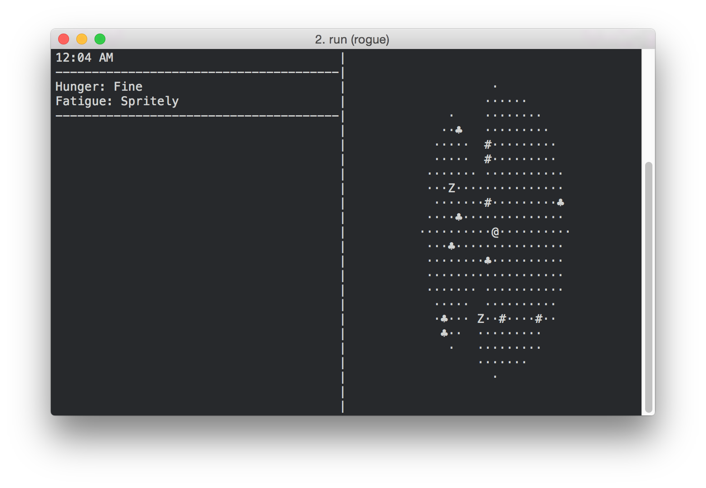

# rogue

This is a little Haskell. It is not actually a game, nor playable, and it's unlikely that it will ever become so. In fact it is mostly an implementation of [digital FOV](http://www.roguebasin.com/index.php?title=Digital_field_of_view), because I'd never done that before and didn't know how.

There's also [a video demo](./demo.mov) that shows off the cutting-edge "animations," i.e. actors that act faster than the character.
